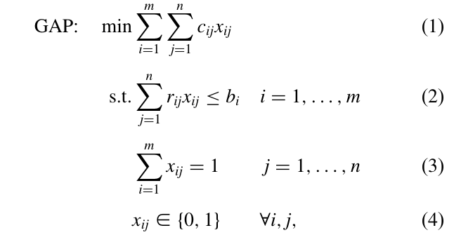

# Application of the Generalized Assignment Problem to Project Allocation  
  
This repository serves as a Proof-of-Concept to show that the Generalized Assignment Problem (GAP) can be used to allocate projects to students. The GAP is a generalization of the classical Assignment Problem (AP) and is a well-known NP-hard problem.  
  
## Application of the GAP  
  
In literature a lot of applications of the GAP are discussed but the most common one is the assignment of tasks to workers.  
  
In theory the GAP could also be used to allocate projects to students. The PoC Code provided in this repository shows that this is possible and that  
there is a lot of room for improvement.  
  
## How it works:  
  
As Temel Öncan shows in his paper: *A Survey of the Generalized Assignment Problemand Its Applications*[^1] from 2007, the GAP can be formulated as an integer linear program (ILP) as follows:  
  
*Image by Temel Öncan (2007) , p. 123[^1]*  

### We define the ILP in Python Code using the [PuLP](https://coin-or.github.io/pulp/) Library as follows:


```python
constraints = []
objective = lpSum([assignments[(s, p)] * priorities[s][p] for (s, p) in possible_assignments])
for s in INPUT_STUDENTS:  
    constraints.append(lpSum([assignments[(s, p)] for p in INPUT_PROJECTS]) == 1)  
# make sure that each project contains at most 4 students but at least 3  
for p in INPUT_PROJECTS:  
    constraints.append(lpSum([assignments[(s, p)] for s in INPUT_STUDENTS]) <= 4)  
	constraints.append(lpSum([assignments[(s, p)] for s in INPUT_STUDENTS]) >= 3)
```

Where the INPUT_STUDENTS are an array of all the students to be assigned, and the INPUT_PROJECTS are an array of all the projects that students can be assigned too.

For the sake of the PoC, it is assumed that each project needs to have at least three students assigned and has a maximum capacity of four students. It would be totally possible to adjust these numbers, even on a project level.

### Using PuLP to solve the ILP:

Using PuLP the ILP is then solved such that each student is assigned exactly one project (first constraint).

```python
    model = solver.construct_gap(solver.create_model("Project_Assignment", solver.LpMaximize), constraints, objective)
    status = model.solve()
```

The output suggests that an optimal solution was found. From the output the final assignments for the given input parameters would be:
```
Solution:
Project_1: Student2, Student4, Student6
Project_2: Student1, Student3, Student5, Student7
```

## Future Improvements

Since the given code acts only as a Proof-of-Concept there are a lot of improvements to be made. First the identification from Students given the models decision variables needs to be improved.

For a given Use-Case at the University of Leipzig, the project selection constraints need to be adjusted aswell. In the Use-Case only project with at least three students assigned would be valid. Any number of students below three would result in the project not being chosen and the students being assigned to different projects. For this purpose, a second set of decision variables should be introduced to determine which projects are selected in the first place.
  
  
  
[^1]: Temel Öncan, *A Survey of the Generalized Assignment Problem and Its Applications*, 2007, https://doi.org/10.3138/infor.45.3.123****